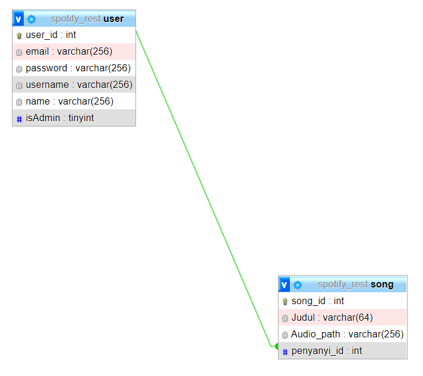

# IF3110 Pengembangan Aplikasi Berbasis Web

> _This is a project done to fulfil one of IF3110's course assignment._

## Description Web Service

## Skema Basis Data
Terdapat 2 tabel basis data yang digunakan yaitu sebagai berikut:
1. Tabel song, yang terdiri atas atribut song_id, Judul, Audio_path, penyanyi_id
2. Tabel user, yang terdiri atas atribut user_id, email, password, username, name, isAdmin
Berikut skema dari basis data yang digunakan :

## How To Install
1. Teks Editor yang kami sarankan adalah Visual Studio Code yang panduan download dan installnya dapat dilihat pada tautan berikut ini [vscode](https://www.belajarisme.com/tutorial/install-vscode/#:~:text=Sekarang%20mari%20kita%20install%20VSCode%20dengan%20cara%20berikut,Select%20Star%20Menu%20Folder%20klik%20Next.%20More%20items)
2. Panduan instalasi JavaScript dapat dilihat pada tautan berikut [JS](https://www.duniailkom.com/javascript-uncover-panduan-belajar-javascript-untuk-pemula/)
3. Panduan instalasi XAMPP dapat dilihat pada tautan berikut [XAMPP](https://webhostmu.com/cara-install-xampp/#:~:text=Cara%20Install%20XAMPP%20di%20Windows%201%201%29%20Download,8%29%20Tunggu%20proses%20instalasi%20selesai%20...%20More%20items)
4. Panduan instalasi MySQL dapat dilihat pada tautan berikut [MySQL](https://www.duniailkom.com/tutorial-mysql-download-install-dan-setingan-awal-mysql/)
## How To Run
Buka folder htdocs yang berada di dalam folder XAMPP, lalu clone repository ini. Selanjutnya jalankan
command "npm run dev"

## Authors
<table>
  <tr >
      <td><b>Backend Binotify Premium Fungsi Login Register</b></td>
      <td><b>Backend Binotify Premium Fungsi Check and Get Subscription</b></td>
        <td><b>Backend Binotify Premium Fungsi Approve and Reject Subscription</b></td>
        <td><b>Backend Binotify Premium Fungsi Get Song and User</b></td>
        <td><b>Backend Binotify Premium Endpoint Get List Penyanyi dan Song</b></td>
    </tr>
    <tr >
          <td>13520051, 13520140, 13520147</td> 
        <td>13520051, 13520140, 13520147</td> 
        <td>13520051, 13520140, 13520147</td> 
        <td>13520051, 13520140, 13520147</td> 
        <td>13520051, 13520140, 13520147</td> 
   </tr>
</table>
